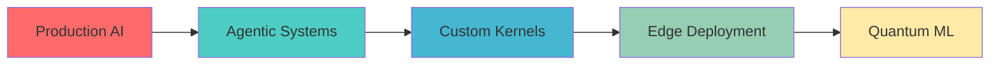

<div align="center">

# Sahibpreet Singh
### GenAI Consultant • Production ML Systems • $700K+ Project Impact

*"Working with LLMs is awesome but the real challenge comes when we ask 'How do we evaluate the output?'"*

[](https://sahibpreetsingh12.github.io)
[](https://www.linkedin.com/in/sahibpreetsinghh/)
[](https://www.kaggle.com/sahib12)
[](https://sahibpreetsingh12.github.io/assets/resume/sahibpreet-singh-resume.pdf)


</div>

---

## 🚀 **Current Mission**

Building **Agentic RAG systems** at **CGI** that don't just work in demos—they scale in production and drive real business value.

```python
class SahibpreetSingh:
    def __init__(self):
        self.role = "GenAI Consultant @ CGI"
        self.focus = ["Agentic AI", "RAG Systems", "LLM Evaluation", "Production ML"]
        self.recent_wins = {
            "project_value": "700K USD secured",
            "efficiency_gain": "65% recruitment time reduction", 
            "performance": "31% ML pipeline optimization"
        }
    
    def current_obsessions(self):
        return [
            "Tokenizer fertility rates 🔬",
            "Zero-trust AI architectures 🔒", 
            "Custom CUDA kernels ⚡",
            "RAG evaluation frameworks 📊"
        ]
```

---

## 💼 **Enterprise Impact**

<table>
<tr>
<td width="50%">

### 🎯 **CGI (Current)**
- **Agentic RAG Architecture** → $700K project win
- **Zero-Trust RAG System** → 65% faster recruitment  
- **Databricks + PySpark** → 31% speed boost

### 📈 **AI Talentflow** 
- **Resume-2-ResumeRAG** → $15K revenue increase
- **Production GenAI** → Docker + AWS ECS deployment

</td>
<td width="50%">

### 🔬 **Tatras Data**
- **Text-to-SQL with LLMs** → 23% MAU growth
- **ML Transaction Analysis** → 62% accuracy improvement
- **Contextual Chatbots** → 128% revenue increase

### 💡 **ZS Associates**
- **Forecasting Models** → $325K annual revenue
- **Pharma Competition Analysis** → Advanced SBERT/RoBERTa

</td>
</tr>
</table>

---

## 🛠️ **Tech Arsenal**

<details>
<summary><strong>🧠 AI/ML Stack</strong></summary>

```python
frameworks = {
    "llm": ["Langchain", "LlamaIndex", "Transformers", "PyTorch"],
    "agentic": ["CrewAI", "Langgraph", "Autogen", "SmolAgents"],
    "classic_ml": ["Scikit-Learn", "Keras", "XGBoost"],
    "evaluation": ["Custom metrics", "RAGAS", "TruLens"]
}
```
</details>

<details>
<summary><strong>☁️ Cloud & Infrastructure</strong></summary>

```yaml
Azure: [Promptflow, Blob Storage, Key Vault, AI Search, ML Studio]
AWS: [ECS, Lambda, SageMaker, S3]
Data: [Databricks, PySpark, CosmosDB, Neo4j, MongoDB] 
DevOps: [Docker, Terraform, GitHub Actions, Azure DevOps]
```
</details>

<details>
<summary><strong>⚡ Performance & Optimization</strong></summary>

```cpp
// Custom CUDA kernels for LLM inference
__global__ void optimized_attention_kernel() {
    // Triton-powered implementations
    // KV-cache optimization
    // Quantization strategies
}
```
</details>

---

## 📊 **GitHub Stats**

<div align="center">


</div>

---

## 🎓 **Knowledge Sharing**

### 📝 **Latest Blog Posts** ([Read More →](https://sahibpreetsingh12.github.io))
- 🔬 **Fertility of Tokenizers** - Why subword counts matter in production
- 📊 **LLM Evaluation Beyond Accuracy** - Metrics that predict user satisfaction  
- ⚡ **Agentic RAG in Production** - Scaling multi-agent systems
- 🚀 **Triton Kernels for LLM Inference** - Custom GPU optimization

### 🏆 **Community Impact**
- 👨‍🏫 **100+ Students Mentored** in NLP/AI workshops
- 📺 **Technical Content Creator** on LinkedIn (Growing audience)
- 🥈 **IEEE Hackathon Winner** - Explainable AI (2nd Place)
- 📊 **Kaggle Mentor** - Helped 50+ beginners start DS journey

---

## 🏗️ **Featured Projects**

<table>
<tr>
<td width="50%">

### 🤖 **Resume-2-ResumeRAG**
*Production GenAI System*
- Fine-tuned LLMs + Custom RAG
- Docker containerized + AWS ECS
- **$15K revenue impact**

**Tech:** `PyTorch` `Langchain` `Docker` `AWS`

</td>
<td width="50%">

### 🔒 **Zero-Trust RAG System** 
*Enterprise AI Security*
- Semantic matching + Azure Key Vault
- Azure Web Apps deployment
- **65% efficiency improvement**

**Tech:** `Azure` `Python` `RAG` `Security`

</td>
</tr>
</table>

---

## 📈 **Current Learning**



- 🎓 **AI & ML Postgraduate** - Lambton College (2024-2025)
- 🔬 **Research Focus**: Tokenizer optimization, Evaluation frameworks
- 📚 **Always Learning**: Latest papers, production patterns, optimization techniques

---

## 💬 **Let's Build Something Amazing**

<div align="center">

### **Interested in collaborating?**

I'm always excited to discuss:
- 🚀 **Scaling GenAI** beyond proof-of-concepts
- 📊 **LLM Evaluation** that actually works  
- 🔧 **Production ML** war stories and solutions
- 📚 **Knowledge sharing** and mentoring opportunities

[](https://www.linkedin.com/in/sahibpreetsinghh/)
[](mailto:ss9334931@gmail.com)
[](https://sahibpreetsingh12.github.io)

</div>

---

<div align="center">

### *"Building AI systems that work in the real world, one commit at a time."* ⚡


**⭐ Star my repos if you find them helpful!**

</div>
